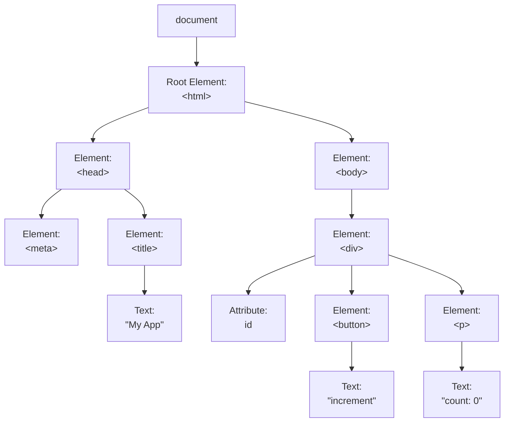

# Virtual DOM

Why did **React**/**Vue.js** come to dominate?

---
layout: two-cols
transition: slide-up
level: 2
---

# Virtual DOM とは？

通称: 仮想 DOM

Web フロントエンドに革命を起こした技術

2013 年初頭に React により発明され、その後 React と Vue.js によって広く知られる

それまでの Web フロントエンドでは、人間が Web API を叩いて直接 DOM を操作していたが、

1. DOM 操作系は根本的に遅い・重い
2. Web API を直接叩く手法は設計が困難
3. 人間が Web API を叩くと無駄が多い

というまあまあ厄介な課題が存在した

VDOM はこれらの問題を解決するために生まれたもので、View の更新に抽象化層を設けることで Web API を叩く回数を減らすことを試みたもの

::right::

<div class="grid gap-4">
  
  
</div>

---
layout: two-cols
transition: slide-up
level: 2
---

# そもそも DOM とは

Document Object Model の略

簡単に言えば HTML や XML 文書を木構造で表現したもの

JavaScript はこれを使用して HTML を操作する

このような HTML があった場合

```html
<html>
  <head>
    <meta charset="utf-8" />
    <title>My App</title>
  </head>
  <body>
    <div id="root">
      <button>increment</button>
      <p>count: 0</p>
    </div>
  </body>
</html>
```

::right::

<div class="text-center">



こうなる

</div>

---
layout: two-cols
transition: slide-up
level: 2
---

# 具体的に何をしているか？

VDOM のロジック

先にも説明したように、DOM を直接操作する手法は難儀が多い

そこで React チームは、Web API をアセンブラに見立て、そこに対応する IR（中間表現）のようなものを作ろうと考えた

具体的には、View の更新が必要な際に、いきなり DOM に対して直接的操作を行うのではなく、まず JavaScript 上に仮想的な DOM 構築しそこで View を更新する

そしてその更新前後で差分を検出し、最終的に計算された必要最低限の差分だけを DOM に反映させる

::right::

つまり **VDOM は言ってしまえばただの JavaScript のオブジェクト**

```js twoslash
const vnode = {
  type: "div",
  props: { id: "my-app" },
  children: [
    {
      type: "p",
      props: {},
      children: [`count: 0`],
    },
    {
      type: "button",
      props: { onClick: increment },
      children: ["increment"],
    },
  ],
};
```

<small class="opacity-50">Vue.js の Patch Rendering における簡易的な例</small>

---
layout: statement
transition: slide-up
level: 2
---

# VDOM の課題

---
layout: statement
transition: slide-up
level: 2
---

# SEO に弱い

VDOM の課題その 1

<div class="grid grid-cols-2 gap-6 text-left">

<div>

VDOM で全てをレンダリングする手法、通称 CSR（狭義の SPA）では、あらゆるコンテンツがブラウザ上で JavaScript によって動的に生成される

このために、検索エンジンのクローラーが適切に Indexing できない問題が発生した

</div>

<div>

```html
<html>
  <head>
    <title>My app</title>
  </head>
  <body>
    <div id="root"></div>
  </body>
</html>
```

<small class="opacity-50">クローラーにはただの中身が空の `<div />` と認識されたやつ</small>

</div>

</div>

---
layout: statement
transition: slide-up
level: 2
---

# ランタイムが重い

VDOM の課題その 2

VDOM はその構造と登場した時代の都合上、全てクライアントの JS で動作することが前提となっている\
View の更新のために大規模な最適化基盤を追加搭載するため、バンドルサイズがめちゃくちゃでかい

これが当時問題となった、SPA の FMP 問題

<div class="text-2xl">

いわゆる **SPA 最初のレンダリング遅過ぎ問題**

</div>

---
layout: statement
transition: slide-up
level: 2
---

# 別に速くはない

VDOM の課題その 3

勘違いされがちだが、**VDOM は別に速くはない**

理屈は単純で、VDOM の操作は最終的な DOM 操作に**加えて**行われるので、直接 DOM を叩く方法に速度で勝ることはない

ちなみにこれは React が世に解き放たれた公演 React チームの Pete による、JSConf EU 2013 の **Rethinking Best Practices** にて既に解説されている

VDOM は速いのではなく、**そのままでは遅すぎたものを十分に速くしたもの**

---
layout: image-right
image: /vdom/rethinking-best-practices.jpg
transition: slide-up
level: 2
---

# Pete による解説

JSConf EU 2013 の Pete による公演 **Rethinking Best Practices** にて

> React は魔法ではない
> <br /><br />
> C 言語でアセンブラを使用して C コンパイラに勝てるのと同様に、必要に応じて生の DOM と DOM API を使えば React に勝つことができる
> <br /><br />
> しかし、C や Java、JavaScript を使うとプラットフォームの詳細について心配する必要がなくなるため、パフォーマンスが桁違いに向上する
> <br /><br />
> React を使うことで、パフォーマンスを気にすることなくアプリケーションを構築することができる
> <br /><br />
> 何よりもデフォルトの state は十分に高速だ

---
layout: statement
transition: slide-up
level: 2
---

# 体験が悪い

VDOM の課題その 4

当時の React や Vue.js エコシステムにはろくな Scaffolding 手段がなかった

皆自前で Babel（トランスパイラ）や Webpack（バンドラ）の設定を書いており、フロントエンド開発者が **Babel 筋** や **Webpack 筋**、**ビルド職人** と呼ばれていたのもこの時代

少し経って Create React App が生まれたが、これはこれで設定ファイル群をあまりにも秘匿しすぎで扱いにくかった

また React Router ビッグバンリリースにより **React Router 被害者の会** が生まれたのもこの辺りで

全体を通して開発しにくかった

---
layout: image-right
image: https://cover.sli.dev?377d4cd9
transition: slide-up
level: 2
---

# まとめ

結局何だったのか？

React/Vue.js により、ライブラリにならった書き方をするだけで、それまでよりもよっぽど軽く・堅牢なアプリケーションを作れるようになった

他方で、SEO 的な課題や、初期表示の遅さ、開発体験の悪さなど、VDOM 由来の新たな課題も発生した

---
layout: statement
transition: slide-left
level: 2
---

# 続いて
